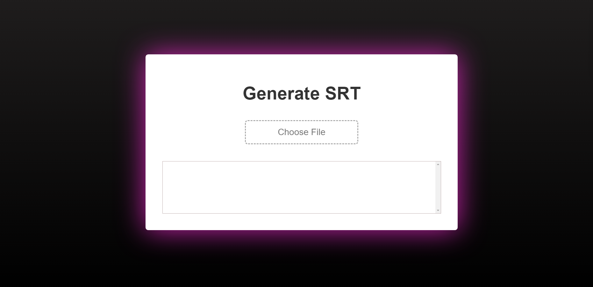

# SRTgenerator - Automatic Subtitle Generation Web App

SRTgenerator is a web application designed to automate the process of generating subtitles (SRT files) for audio and video files. Built using the Flask framework, this app integrates audio and video processing, transcription, and subtitle creation into a seamless user experience. It provides a user-friendly interface for uploading files, generating subtitles, and downloading the final SRT files.



## Features

- **Upload and Process:** Upload audio or video files and have them automatically processed for transcription and subtitle generation.
- **Automatic Transcription:** The app utilizes the Whisper ASR (Automatic Speech Recognition) model for transcribing audio segments.
- **Supported Formats:** Supports MP4, WAV, and MP3 file formats for both audio and video input.
- **Subtitle Generation:** Generates SubRip (SRT) files containing timestamped text based on the transcribed content.
- **User-Friendly UI:** A clean and intuitive interface that guides users through the entire process.

> **Note:** The current version of the app can be resource-intensive, especially during audio and video processing. Generating accurate subtitles may take time due to transcription processes.

## Future Plans

In the future, we aim to optimize the app's resource usage and make it available online for free usage. We are actively working to enhance the performance and responsiveness of the app to provide a smoother experience for users.

## Installation

1. Clone the repository:
   ```sh
   git clone https://github.com/droidyprojectum/SRTgenerator.git
   ```

2. Navigate to the project directory:
   ```sh
   cd srtgenerator
   ```

3. Create two empty folders for file management:
   - `uploads`: This folder is used to store the uploaded audio and video files.
   - `downloads`: This folder will store the generated SRT files.

4. Install the required Python packages:
   ```sh
   pip install Flask whisper
   ```

## Usage

1. Run the Flask app:
   ```sh
   python app.py
   ```

2. Open a web browser and go to `http://localhost:5000` to access the SRTgenerator interface.

3. Follow the on-screen instructions to upload your audio or video files and generate subtitles.

## Features in Detail

- **Transcription Process:** The app automatically transcribes audio segments using the Whisper ASR model. It processes both uploaded audio files and extracted audio from video files.

- **Subtitle Generation:** Once transcription is complete, the app generates SubRip (SRT) files. These files include timestamped text, making them suitable for use with video players.

## Customization

- **Styling:** Customize the appearance of the app by editing the `styles.css` file located in the `static` folder.

## Contributing

Contributions are welcome! If you have ideas for improvements or find any issues, feel free to open a pull request or submit an issue.

1. Fork the repository.
2. Create a new branch: `git checkout -b feature/my-feature`.
3. Make your changes and commit them: `git commit -m 'Add some feature'`.
4. Push to the branch: `git push origin feature/my-feature`.
5. Open a pull request.

## License

This project is licensed under the MIT License. See the [LICENSE](./LICENSE) file for details.
